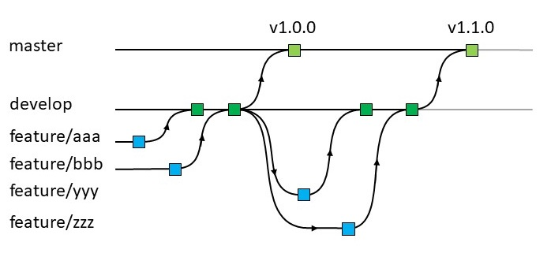

# GitFlow implementatie

Dit document is geen tutorial over GitFlow, het beoogd slechts een uitleg te geven over de wijze waarop GitFlow geïmplementeerd is binnen de GitHub repositories van VNG Realisatie. Wil je meer inzicht in GitFlow hebben dan verwijzen we je naar deze [tutorial](https://www.atlassian.com/git/tutorials/comparing-workflows/gitflow-workflow) en deze [cheatsheet](https://danielkummer.github.io/git-flow-cheatsheet/).

GitFlow is eigenlijk niets meer dan een set van afspraken. Afspraken over met welke branches wordt gewerkt en hoe deze met elkaar worden gemerged. Het kenmerkt zich dus door het gebruik van enkele standaard branches die elk een specifieke functie vervullen. GitFlow kent standaard de volgende branches:

* 'master' of 'main'
* 'develop'
* 'feature'
* 'release'
* 'hotfix'
* 'support'

Binnen de VNG Realisatie respositories wordt echter alleen gebruik gemaakt van de eerste 3 branch types. 

> Het is binnen VNG Realisatie gebruik om de werkwijze van GitFlow pas te implementeren na de eerste officiële versie. Het valt echter te overwegen om meteen bij initialisatie van de GitHub repository deze in te richten op het gebruik van GitFlow en ook direct volgens dat principe te werken.
 
## 'master' of 'main' branch 

De 'master' (of tegenwoordig vaak 'main') branch is standaard al aanwezig in een GitHub repository. In onze implementatie van GitFlow wordt deze alleen gebruikt om afgeronde ontwikkelstadia naar te kunnen committen. Uiteindelijk worden op basis daarvan in de 'master' branch de releasetags gegenereerd. Dat hoeven overigens niet alleen final releases te zijn. Ook een 0.0.1 release kan daarvoor in aanmerking komen, net wat je wil.

> De 'master' branch wordt ook gebruikt om vanuit de 'docs' folder de GitHub page site van de betreffende repository te genereren.

## 'develop' branch

De 'develop' branch kan meteen bij initialisatie van een repository aangemaakt worden maar ook later. Als deze later wordt aangemaakt dan moet de inhoud van de master branch daarheen gekopieerd worden om voort te kunnen borduren op wat er al is. In de GitFlow methodiek vindt doorontwikkeling plaats in de 'develop' branch. Ontwikkelaars die ontwikkelen op deze repository zullen, nadat ze hem ge'cloned' hebben, dus op de 'develop' branch moeten gaan werken. Zoals ze normaliter, in een repository zonder GitFlow werkwijze, zouden werken met de 'master' branch werken ze nu met de 'develop' branch.

Zodra een de 'develop' branch een status heeft bereikt die men als een release wil bewaren wordt de inhoud van de 'develop' branch gecommit naar de 'master' branch. Daarna kan de 'develop' branch weer worden gebruikt om op door te ontwikkelen.

> Het lijkt me een goed idee om het committen van de 'develop' branch naar de 'master' branch te beleggen bij een bepaalde rol. Alleen personen die die rol vervullen verzorgen dus de commit naar de 'master'. Vermoedelijk zijn dat ook dezelfde personen die uiteindelijk de release tag aanmaken.

## 'feature' branches

Waar de 'master' en 'develop' branches structurele branches zijn, zijn 'feature' branches vluchtiger. Ze bestaan slechts zolang als nodig is om het betreffende feauture te implementeren. Heeft dat de gewenste kwaliteit bereikt dan wordt een feature branch met de 'develop' branch gemerged en houdt deze op te bestaan. Een 'feature' branch wordt nooit met de 'master' branch gemerged.

Feature branches zijn te herkennen aan hun naam, deze start nl. altijd met 'feauture/'.

## Resulterende flow

De resulterende flow kan er dan uiteindelijk als volgt uitzien:

