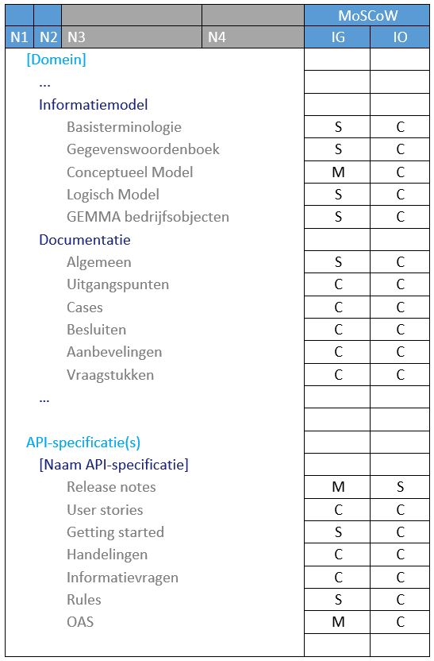

# Uniformering GitHub Pages

## Inhoudsopgave
* [Algemene naamgeving](#algemene-naamgeving)
* [Navigatiestructuur](#navigatiestructuur)
  * [Top-menu](#top-menu)
  * [Side-menu](#side-menu)
* [Pagina content](#pagina-content)
* [Techniek](#techniek)

Kenniscentrum Architectuur & Standaarden publiceert daar vervaardigde API-specificaties vanuit GitHub m.b.v. GitHub Pages. Teneinde dat op een 
eenduidige wijze te doen zijn daar afspraken over gemaakt. Die afspraken zijn vooral technisch van aard en bieden dus nog veel vrijheid m.b.t. 
de structuur en inhoud. De documentatie kan daardoor minder eenduidig aangeboden worden dan gewenst. Voor een correcte en volledige implementatie 
van de API-specificaties in API’s is het van belang dat Product Owners en Developers de informatie die zij zoeken eenvoudig kunnen vinden maar 
ook dat de informatie waarvan wij als Kenniscentrum vinden dat ze van belang zijn niet door hen over het hoofd wordt gezien. Daarvoor is het 
van belang dat wij de informatie altijd op dezelfde wijze en via dezelfde weg aanbieden. Onderstaande Best Practice voorziet in afspraken op dat 
vlak en is dus aanvullend voor de eerder genoemde afspraken.

De afspraken hebben betrekking op de door ons gehanteerde naamgeving, welke informatie we aanbieden en in welke structuur we dat doen. M.b.t. de 
naamgeving verwijzen we naar het GEMMA begrippenkader maar bieden we hier voor enkele termen wat aanscherpingen. Met de structuur doelen we vooral 
op de structuur van de top- en side navigatie. In dit document beschrijven we wat er maximaal in die navigatie menu’s kan worden opgenomen, welke 
informatie minimaal aanwezig hoort te zijn en welke informatie facultatief is. 
Als afsluiting gaan we nog even in op enkele technische onderwerpen.

## Algemene naamgeving

[Naar boven](./Uniformering%20GitHub%20Pages)

Bij het praten over API-specificaties bestaat de neiging een aantal termen door elkaar heen te halen. Dit is sterk afhankelijk van de persoon die 
ze gebruikt of de personen waarmee het gesprek gevoerd wordt. Het veroorzaakt echter spraakverwarring wat weer leidt tot misverstanden. Om dat te 
voorkomen is het van belang om afspraken te maken over wat we precies onder welke term verstaan, onszelf daar vervolgens aan te houden en onze 
stakeholders op te voeden in het juiste gebruik. Een definitie van de termen is te vinden in het GEMMA begrippenkader. Door de termen in dat 
begrippenkader te gebruiken versterken we de link tussen de API-specificaties en de GEMMA. Hieronder verduidelijken we een aantal van deze termen 
en scherpen ze nog wat aan. Voor de lezers van de API-specificaties minder interessant maar ons helpt het ons werk goed te doen.

### API
Application Programming Interface. Een API is een concrete interface en is dus software. In spreektaal gebruiken we dit vaak als we niet zo 
nauwkeurig (hoeven te) zijn. In de door ons geschreven teksten is nauwkeurigheid echter essentieel. In het kader van standaarden spreken we 
dus over API-specificatie, een beschrijving van een interface.

Daarnaast speelt nog dat we m.b.t. API’s binnen VNG-R twee soorten API’s onderkennen:
*	JSON over HTTP;
*	Webservices (SOAP-API’s).

Als we het binnen VNG-R over API-specificaties hebben dan bedoelen we in feite REST-API-specificaties. SOAP-API-specificaties kennen we in 
het kader van de StUF standaarden.

### OAS
Open API Specificatie. Een in de yaml syntax beschreven berichtenschema en end-point definitie. 

**Let op!** Vermijd de term ‘OAS-specificatie’.

### API-specificatie
Een beschrijving van een interface/koppelvlak. Naast de OAS bestaat dit uit alle in GitHub aanwezige informatie die de OAS verduidelijkt en/of 
aanscherpt zoals:
*	Rules;
*	Informatiemodel;

### Gestandaardiseerde API-specificatie
In het woord 'API-standaard' lopen twee zaken door elkaar. Het WAT (API-specificatie) en de STATUS (tot standaard verklaard). Vaak gebruiken we het als synoniem 
voor API-specificatie wat niet handig is aangezien niet iedere specificatie al tot standaard ‘is verheven’. API-standaarden worden door het College 
van Dienstverlening of het Forum Standaardisatie vastgesteld. We kiezen er daarom voor ‘API-standaarden’ aan te duiden als ‘gestandaardiseerde 
API-specificaties’. Niet-gestandaardiseerde specificaties zijn ‘gewoon’ ‘API-specificaties’.

### Ondersteunende API-documentatie
Deze documentatie is aanvullend op de API-specificatie en staat over het algemeen eveneens in GitHub. Hiertoe kan behoren:
*	Uitgangspunten;
*	Genomen besluiten waaronder ontwerpbeslissingen;
*	Tutorial;
*	Getting Started;
*	Testscript;
*	Testbestanden
*	User Stories
*	Release notes

## Navigatiestructuur

[Naar boven](./Uniformering%20GitHub%20Pages)

### Top-menu

[Naar boven](./Uniformering%20GitHub%20Pages)

De doorontwikkeling van StUF-standaarden staat op dit moment stil en in feite zitten we in een transitie naar API-specificaties. Dat onderscheid 
komt tot uitdrukking in het top-menu. API-specificaties zijn te vinden onder het menu-item ‘API-specificaties’ de  StUF-standaarden onder het 
menu-item ‘StUF standaarden’.

Binnen de API-specificaties onderkennen we nog API-specificaties die deel uitmaken van een groep van API-specificaties (bijv. die van ZGW) en 
API-specificaties die geen deel uitmaken van een groep (bijv. de ORI API-specificatie). We spreken af dat API-specificaties die onderdeel uitmaken 
van een groep van standaarden niet zelfstandig worden opgenomen onder het menu-item ‘API-specificaties’. In dat geval wordt de groep waartoe deze 
behoren opgenomen. API-specificaties die geen onderdeel uitmaken van een groep van standaarden worden daar wel in opgenomen.

(Groepen van) API-specificaties die nog ‘In Ontwikkeling’ zijn hoeven niet direct opgenomen te worden in het top-menu. Het is aan de PO van de 
API-specificatie wanneer deze opgenomen wordt. Opname is wel verplicht na ingebruikname van de API-specificatie of een van de API-specificaties 
van de groep.

### Side-menu

[Naar boven](./Uniformering%20GitHub%20Pages)

Het side-menu bevat slechts 2 niveaus. Eventueel benodigde diepere niveaus worden in de pagina’s aangebracht, daarover meer in de paragraaf 
‘Inhoud’. De menu-items in het side-menu worden zoveel als mogelijk gesorteerd van abstract naar concreet. Architectuur staat dus bijvoorbeeld 
boven het informatiemodel.

Hieronder de tabel met de, voor nu, maximale content. M.b.v. de MoSCoW methode wordt aangegeven welke items, in welke vormen (een groep of 
enkelvoudige van API-specificaties) en welke stadia (‘In Ontwikkeling’ of ‘In Gebruik’) van de API-specificaties verplicht zijn en zo niet in welke 
mate ze dan gewenst zijn. De lichtblauwe ‘Groep’ kolom betreft de gemengde situatie waar er binnen een groep al minimaal een API-specificatie 
voorkomt die ‘In Gebruik’ is maar er ook minimaal een API-specificatie nog ‘In Ontwikkeling’ is.

We doorlopen, voor zover nodig, de diverse menu-items. Waar van toepassing wordt aangegeven als menu-items meerdere keren voor mogen komen.

***[Domein]*** 
De naam van dit menu-item wordt gevuld door een korte naam van het domein waar de API-specificatie(s) betrekking op hebben. Dit komt niet 
overeen met de in GEMMA onderkende domeinen. Enkele voorbeelden zijn ‘Zaakgericht werken’ en ‘Klantinteracties’.

Moet in alle vormen en in alle stadia van een ontwikkeltraject aanwezig zijn.

***Introductie*** 
Deze pagina moet in ieder geval in het kort de ‘status’ van alle gerelateerde API-specificaties aanstippen. Wordt er actief beheerd of 
uitsluitend correctief, is de specificatie vastgesteld als standaard en zo ja met welke mate van verplichting?

Op deze pagina kan een directe link naar ‘Ontwikkeling’ pagina worden opgenomen (te benaderen via ‘Over -  Ontwikkeling’). Daar wordt dan 
een uitgebreidere toelichting op de status geplaatst. 

Onderwerpen die hier aan bod komen zijn:
*	Bronnen;
*	Privacy en Security;
*	Werkingsgebied;
*	Gerelateerde standaarden. Incl. de met de versies van de onderliggende specificatie compatibele versies.

***Productvisie*** 
Een Productvisie bevat een beknopte beschrijving van het gewenste toekomstige eindresultaat van het product. Het dient als een richtlijn 
voor een Scrum Team, klant en Stakeholders om een gemeenschappelijk begrip te hebben van de richting waar het product naartoe moet en waarom 
het waardevol is.

Onderwerpen die hier aan bod komen zijn:
*	De aanleiding om met ontwikkeling van de specificatie(s) te beginnen;
*	Het beoogde toepassingsgebied van de specificatie(s);
*	De doelen die specificatie(s) dienen;
*	De problemen die specificatie(s) voor verschillende doelgroepen (inwoners/ondernemers, gemeenten, marktpartijen) oplossen of de waarde die 
voor hen anderszins gecreëerd wordt;
*	Belangrijke uitgangspunten die bij de ontwikkeling worden gehanteerd (‘privacy by design’, ‘zero trust’) en wat die betekenen voor het 
beoogde eindresultaat.

***Architectuur*** 
Onderwerpen die in de beschrijving van de architectuur aan bod komen zijn:
*	de inpassing van de API-specificaties in de totale gemeentelijke architectuur (GEMMA);
*	de globale opzet van de API-specificaties;
*	de gedachte achter de opzet van de API-specificaties. 
   Het gaat hier om de gedachtes achter de gekozen architectuur. Waarom is er juist voor die architectuur gekozen. Een soort van verantwoording voor de architectuur dus.
*	verwijzing naar de pagina van de standaard op GEMMA online. De GEMMA standaardenlijst bevat een pagina voor de meeste API-specificaties
en –standaarden. Nieuwe versies en statuswijzigingen in API-specificaties en StUF-standaarden moeten verwerkt worden in het GEMMA ArchiMate-
model. Door hier een verwijzing op te nemen naar de pagina van de standaard op GEMMA online dwingen we onszelf de consistentie in het oog te
houden.

***Documentatie*** 
Dit bevat (een link naar) alle aanvullende documentatie. Documentatie dus die geen onderdeel uitmaakt van de API-specificatie.

***FAQ*** 
Bevat veel voorkomende vragen met een eenduidig antwoord. De basis voor deze vragen zijn o.a. de in de gerelateerde GitHub repository geposte 
issues. Het vertalen van meerdere issues naar duidelijke vragen en het vervolgens uit de verschillende posts extraheren van een antwoord is 
niet altijd even eenvoudig voor bezoekers van de GitHub Pages sites. Met dit menu-item helpen we de bezoekers van de site daar dus mee.

Het stellen van nieuwe vragen en het geven van antwoorden daarop gebeurt echter nog steeds in de gerelateerde GitHub repositories. Zo af en 
toe zullen vragen daarin leiden tot nieuwe items in dit menu-item.

Veel gestelde vragen over beheer en status worden op de daarvoor bedoelde pagina’s beantwoord.

***API-specificatie(s)*** 
In het geval van minimaal één ‘In Gebruik’ API-specificatie wordt dit menu-item opgenomen. Alleen bij meer dan één API-specificaties krijgt 
de titel de meervouds ‘s’.

Indien er nog geen ‘In Gebruik’ versies van een (van de) API-specificatie(s) bestaat dan is dit menu-item optioneel.

***[Naam API-specificatie]*** 
Bevat een korte eenduidige naam van de API-specificatie. In feite is dit de in GEMMA bij de standaard of specificatie aangegeven verkorte notatie. 
In de naam komt de term ‘API’ of zelfs API-specificatie’ niet voor. Dus niet ‘Zaken 
API-specificatie’ maar kortweg ‘Zaken’. Het menu-item geeft toegang tot de ‘In Gebruik’ of, als deze nog niet voorhanden is, de meest recente 
‘In Ontwikkeling’ versie van de API-specificatie.

Een overzicht van de (mogelijk) te behandelen onderwerpen op de met dit menu-item gerelateerde pagina staat in de volgende paragraaf.

***[Title]*** 
1 of meer vrij in te vullen menu-item blokken. Biedt de ontwerper(s) van een API-specificatie de ruimte om de ontwikkeling op een voor hen zo 
optimaal mogelijke wijze te kunnen ondersteunen. 

Gedurende de ontwikkeling van een API-specificatie verhuisd er geleidelijk steeds meer informatie naar andere delen van het side-menu totdat 
dit deel bij in gebruik-name van de API-specificatie helemaal verdwijnt en de site op een natuurlijke wijze er aan toe is te worden opgenomen 
in het top-menu.

Het is de verantwoordelijkheid van de eigenaar van de API-specificatie er voor te zorgen dat het ‘Over’ menu-item niet door deze blokken te ver 
naar beneden wordt gedrukt.

***[Subtitle]*** 
1 of meer menu-items als onderdeel van een van de vrije menu-item blokken.

***Over*** 
Biedt ruimte aan extra informatie zoals ‘Ontwikkeling’, ‘Beheer’, ‘Contact’, 'Omgangsvormen' en 'Licentie'.

***Ontwikkeling*** 
Pagina met uitgebreide informatie over (door)ontwikkeling van de API-specificatie(s). Geeft antwoord op vragen als:
*	Is er sprake van adaptief of correctief beheer?
*	Wordt er gewerkt aan een grotere revisie/major release?
*	Hoe kan men bijdragen?
*	Etc…

Indien er geen sprake is van doorontwikkeling mag als titel voor dit menu-item ook de term ‘Beheer’ worden gebruikt.

***Contact*** 
Bevat een overzicht van alle contactinformatie en links naar sites met aanvullende informatie zoals:
*	Link(s) naar een community site (Slack, Pleio, ...);
*	Link(s) naar de gerelateerde GitHub repositories;
*	standaarden.ondersteuning@vng.nl;
*	Voor zover van toepassing de namen van de
    * API regiseur
    * Product Owner
    * Bericht ontwerper(s)
    * Business analist

***Omgangsvormen*** 
Beschrijft hoe we bij de (door)ontwikkeling met elkaar omgaan teneinde een omgeving te creëren waarin ieders inbreng gewaardeerd wordt. 

***Licentie*** 
Beschrijft onder welke licentie de specificatie valt en voor welke onderdelen dat geldt.

## Pagina content

[Naar boven](./Uniformering%20GitHub%20Pages)

Informatie op het 3e en evt. 4e niveau wordt zoals gezegd niet in het side-menu getoond maar op de bijbehorende pagina 
van het tweede niveau. 

Als leidraad hanteren we de volgende regel voor het creëren van een inhoudsopgave boven aan de pagina’s:

> Indien een pagina meer dan 2 onderwerpen bevat of wanneer de beschrijving van die onderwerpen dermate lijvig is dat
de volgende onderwerpen van de pagina af lopen dan wordt een inhoudsopgave bovenaan de pagina opgenomen.

De pagina’s van een aantal onderwerpen bevatten enkele standaard paragrafen, deze worden zo nodig in deze paragraaf 
beschreven. Hieronder een tabel waarin we de standaard paragrafen voor die onderwerpen hebben opgesomd. Wederom wordt 
m.b.v. de MoSCoW methode aangegeven welke paragrafen verplicht zijn en zo niet in welke mate ze dan gewenst zijn. In 
deze tabel maken we geen onderscheid tussen enkelvoudige API-specificaties en API-specificaties die onderdeel uitmaken 
van een groep.

### Informatiemodel
De in deze pagina opgenomen paragrafen kunnen links bevatten naar de werkelijk met dat onderwerp betrekking hebbende 
documenten. Zo zal de documentatie van een Conceptueel Model over het algemeen niet in deze pagina worden opgenomen 
maar zal er middels een link worden verwezen naar het betreffende document.

***Basisterminologie*** 
Bondige beschrijving van de kern entiteiten in de API-specificatie, in tekst en beeld.

***Gegevenswoordenboek*** 
Lijst van in de API-specificatie en daarop aanvullende documentatie gehanteerde termen.

***Conceptueel Model*** 
Oftewel Conceptueel Informatiemodel. Beschrijving van de modellering van de werkelijkheid binnen het beschouwde domein 
door middel van de beschrijving van welke informatie (data met betekenis en structuur) een rol speelt. Wederom in tekst 
en beeld.

Op termijn zal hiervoor Respec documentatie worden gebruikt gegenereerd uit een door ons in Enterprise Architect vervaardigd 
SIM. Een opgevraagd Respec document zal zonder de GitHub pages top- en side-menu worden getoond in een nieuw tabblad. 

***Logisch Model*** 
Beschrijft of toont hoe de, in het conceptuele informatiemodel onderscheiden, concepten gebruikt worden bij de interactie 
tussen systemen en hun gebruikers en tussen systemen onderling. In tekst en/of beeld.

Suggesties van nog meer op deze pagina op te nemen onderwerpen:
•	Verwijzing naar de GEMMA bedrijfsobjecten. Zie https://www.gemmaonline.nl/index.php/Bedrijfsobjecten_uit_GGM
•	…

### Documentatie
***Algemeen*** 
Overzicht waarin aangegeven wordt welke API-specificatie documentatie aanwezig is, hoe deze is opgezet en zaken zoals 
onderlinge samenhang. In het geval van de vorm en structuur van documentatie-artefacten kan bijv. gebruik gemaakt worden 
van coderingen. Indien dat het geval is wordt daarover op deze pagina uitleg gegeven. Bijv.:

Starten artefacten met een ‘B’, dan is sprake van een besluit, ‘A’ staat voor aanbeveling, daarna volgen altijd vier 
cijfers etc…

Hier wordt geen link opgenomen naar de niet bij de API-specificatie horende aanvullende documentatie.

***Uitgangspunten*** 
Beschrijving van wat als basis voor de ontwikkeling van de API-specificatie(s) is genomen. 

***Cases*** 
Beschrijving van situaties waarin de API-specificatie(s) toepasbaar zijn.

***Besluiten*** 
Tijdens de ontwikkeling van API-specificatie(s) kunnen er issues naar voren komen waarover een besluit moet worden genomen. 
Deze besluiten worden onder dit kopje toegelicht. Het is belangrijk dat er niet alleen wordt beschreven wat er is besloten 
maar ook waarom daartoe is besloten evt. met een beschrijving van alle in overweging genomen alternatieven.

***Aanbevelingen***  
Bevat adviezen door de ontwikkelaars of Product Owner m.b.t. de toepassing of implementatie van de API-specificatie(s). …

***Vraagstukken***  
Beschrijving van de problemen waarvoor in de API-specificatie(s) nog geen oplossing is opgenomen. Idealiter wordt in een van 
de volgende versies van de API-specificatie(s) wel in een oplossing voorzien.

### [Naam API-specificatie]
***Release notes*** 
Beschrijving van de doorgevoerde wijzigingen (incl. De opgeloste fouten met een eventuele link naar een issue) die zijn aangebracht op de API-specificatie excl. de 
Release notes zelf. Let op! Dit is geen uitputtende lijst van alle wijzigingen in alle bestanden.

***User stories*** 
Lijst van alle user stories die met de betreffende release van de API-specificatie zijn geïmplementeerd.

In principe kan zo’n lijst m.b.v. GitHub gegenereerd worden maar daarvoor is wel een standaard werkwijze noodzakelijk. Bepaald 
moet worden of we van deze mogelijkheid gebruik willen maken en zo ja of dat dan optioneel is.

***Handelingen*** 
[Nog te voorzien in een goede definitie]

***Informatievragen*** 
[Nog te voorzien in een goede definitie]

***Regels*** 
Beschrijvingen van het gedrag dat de API moet vertonen in de vorm van gedrags-, afleidings- beperkingsregels, etc. Ook wel 
aanvullende specificaties genoemd. Een mogelijke vorm is Gherkin.

***OAS*** 
Dit bevat voor elke versie van de OAS een link naar de Redoc en Swagger interface. Tevens wordt hierin links opgenomen naar 
de diverse versies van het raw Yaml bestand.

Een opgevraagd Redoc en Swagger document zal zonder de GitHub pages top- en side-menu worden getoond in een nieuw tabblad.

## Techniek

[Naar boven](./Uniformering%20GitHub%20Pages)

Om hetgeen hierboven is geschetst toe te kunnen passen moet met het volgende rekening gehouden worden. 

### GitHub Pages Repository
Het is technisch mogelijk om alle de documentatie van een bij een groep horende API-specificatie onder te brengen in de GitHub 
repository waarin die API-specificatie ook beheerd wordt. Dat is echter bewerkelijk en foutgevoelig. In elke repository moet 
immers het hele side-menu worden geconfigureerd en dus ook de links naar de documenten. De kans is groot dat de side-menu’s 
van een groep van API-specificaties dan van elkaar af gaan wijken of dat links niet goed werken. Ook moeten wijzigingen in 
het side-menu dan op alle respositories worden aangebracht. Onderhoud kost dus meer tijd en energie dan strikt noodzakelijk. 

Advies is dan ook om de documentatie van alle in een groep aanwezige API-specificaties binnen één GitHub repository op te slaan 
en daarvoor in ieder geval elke API-specificatie in de ‘docs’ folder een eigen folder te geven. Dat is de meest eenvoudige manier. 
De enige uitzondering daarop zijn de OAS bestanden die wel in hun eigen GitHub repository kunnen blijven staan wat weer zeer handig 
is voor het beheer daarop.

### Redoc en Swagger
Om te garanderen dat de Redoc en Swagger documenten in een nieuw tabblad zonder top- en side-menu worden getoond moeten voor elke 
release de volgende links in resp. de Redoc en Swagger paragrafen worden geplaatst:

[Linktekst](http://redocly.github.io/redoc/?url=raw link naar het gewenste ‘openapi.yaml’ bestand){:target="_blank"}

[Linktekst](https://petstore.swagger.io/?url= raw link naar het gewenste ‘openapi.yaml’ bestand) {:target="_blank"}

Een voorbeeld:

&lsqb;ReDoc&rsqb;&lpar;http:&sol;/redocly.github.io/redoc/?url=https://raw.githubusercontent.com/VNG-Realisatie/gemma-verwerkingenlogging/master/docs/api-write/oas-specification/logging-verwerkingen-api/openapi.yaml){:target="_blank"}

### Template repository
In de template repository API-specificatie-template-repository is o.a. de in dit document geschetste structuur uitgewerkt. Deze repository 
kan gebruikt worden om een nieuwe repository te genereren. Zie daarvoor de link in het README.md bestand van die repository. Een verzoek 
daartoe kun je indienen bij de VNG-R GitHub administrators. 

De hieronder getoonde, in genoemde template repository uitgewerkte structuur, kun je ook naar reeds bestaande repositories kopiëren en 
daarna naar eigen smaak aanpassen.

In deze structuur worden ook de template md documenten opgenomen met daarin de in dit document voor die md documenten voorgestelde onderwerpen.
De redacteur van de GitHub Pages repository of de PO van de API-specificatie heeft dan een leidraad, is zich bewust van wat hij nog moet 
documenteren en van wat hij besluit om juist niet op te nemen.
